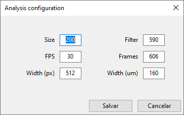
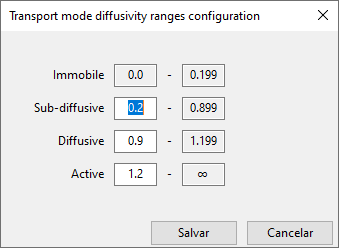
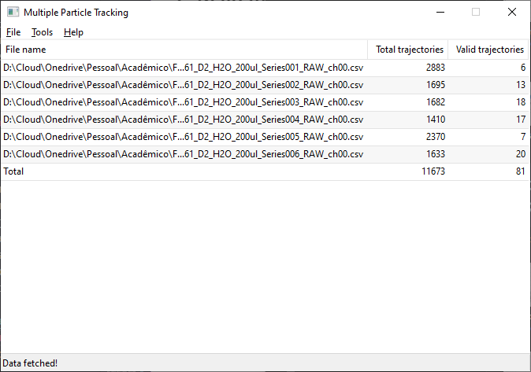
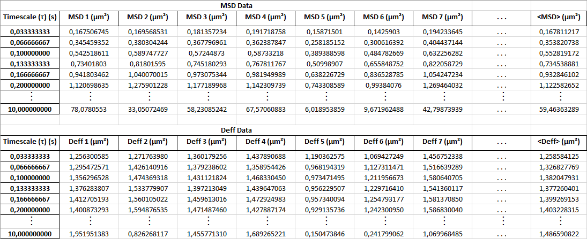
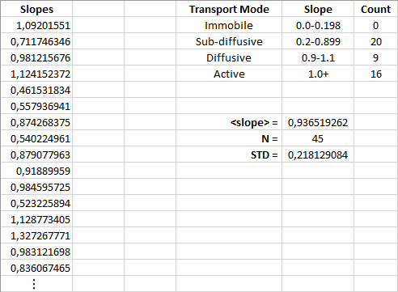

# MPT Analysis

The Multiple Particle Tracking Analysis application that generates reports with organized information about particle displacement, to help on the analysis of data from video microscopy analysis generated by ImageJ (using Mosaic plugin).

The application relies on the following workflow:

1. Solution preparation;
2. Video acquisition;
3. Video analysis (using ImageJ with Mosaic plugin);
4. Data analysis (performed by this app and described bellow).

## App installation

Just download the latest version for your Operating System and use. No need for installation.

## App usage

This application reads an ImageJ report. It only accept the file generated by 'All Trajectories to Table' button on the Mosaic plugin. As this is a '.csv' file, just this file format is allowed. If, however, any other file is used, the application should just ignore.

## The workflow

### 1. Review configuration

There are some configurations that need to exist in order to allow the app to make its calculations. There are 3 main configuration groups:

#### 1.1. App configuration

The App configuration basically means input and output folder. The App saves this folder's path in a way to make it easy for the user.
We understand that the user may have a specific folder with result files (from ImageJ) and a different one for report files (from this App).
The default configurations are:

| Operating System | Input folder                 | Output folder                        |
| ---------------- | ---------------------------- | ------------------------------------ |
| Windows          | C:\\Users\\\<username>\\.mpt | C:\\Users\\\<username>\\.mpt\\export |
| Linux            | /home/\<username>/.mpt       | /home/\<username>/.mpt/export        |
| Mac OS           | /Users/\<username>/.mpt      | /Users/\<username>/.mpt/export       |

If those folders don't exist, they will be created at first App use.
_**The values are saved each time the user uses the App.**_

#### 1.2. Analysis configuration

This configurations relate to the video acquisition parameters (except for the particle size, that usually comes from known particle size provided by manufacturer).

The default values are:
| Configuration | Description | Default value |
| ------------- | ----------- | :-----------: |
| Size | Particle size (in SI unit $nm$) | 200 |
| Filter | Minimum number of consecutive frames a trajectory must have to be considered valid for analysis. | 590 |
| FPS | Frames per second used during video acquisition. | 30 |
| Total frames | Total number of frames in video. | 606 |
| Width ($px$) | Width of the acquired video, in pixels. | 512 |
| Width ($\mu m$) | Width of the acquired video, in SI unit $\mu m$. | 160 |

Those values are pre-defined based on previous experiment and can be changed in the App.

The values can be changed, as seen in the screenshot bellow.

#### 1.3. Diffusivity ranges configuration

As one of the report generated by the App is about diffusivity, the _Transport Mode Characterization_ ranges are essential.

The default values are:
| Transport Mode | Low value | High value |
|----------------|:---------:|:----------:|
| Immobile | 0.0 | 0.199 |
| Sub-diffusive | 0.2 | 0.899 |
| Diffusive | 0.9 | 1.199 |
| Active | 1.2 | 1.2+ |

The values can be changed, as seen in the screenshot bellow.

---

### 2. Read the file(s)

By clicking on the 'Open files' sub-menu, under 'File' menu, a dialog appears. This dialog allows the user to open multiple files.

")

After reading the files, a summary table will show at the main window. This table shows the file name, total trajectories and valid trajectories is displayed on screen. At the bottom of the list, a total is displayed. For statistical purposes, approximately 100 valid trajectories must exist.

---

### 3. Start analysis

Configuration reviewed, reports loaded to app, it is time to make some math.
Under 'Tools' menu, 'Analyze' sub-menu starts analysis. This sub-menu is disable at startup and only becomes enabled if the previous step occurs with no errors.

**TODO: Add image (before/after menu)**

The app must process the data from those files and do a series of calculations, described bellow:

-   Keep only those trajectories longer than the minimum frame number defined by the filter configuration.
-   Compute MSD (Mean-squared Displacement) for the group of results (near 100 trajectories)
-   Compute Deff (Diffusivity efficiency coefficient) for the group of results (near 100 trajectories)
-   Compute Diffusivity for each trajectory

Along the process, the statusbar shows info about the overall process.
When it's done, a dialog informs the user.

---

### 4. Export reports

Now that analysis has been done, the user may export the reports. As before, the 'Save' sub-menu, under 'File' menu is disabled at startup. It becomes enabled only after analysis, if ok.
**TODO: Add image (before/after menu)**
There are currently 2 reports available:

#### 4.1. Individual Particle Analysis

This report contains 5 sheets, described bellow:

##### 4.1.1. Data

This sheet contains the data from each valid trajectory Mean-squared Displacement (MSD) and Diffusivity efficiency coefficient (Deff).

##### 4.1.2. \<MSD> vs Time

This sheet contains the Ensemble Mean-squared Displacement (\<MSD>) plot.

##### 4.1.3. MSD vs Time

This sheet contains the Mean-squared Displacement (MSD) plot with all trajectories.

##### 4.1.4. \<Deff> vs Time

This sheet contains the Ensemble Mean-squared Displacement (\<MSD>) chart.

##### 4.1.5. Deff vs Time

This sheet contains the Mean-squared Displacement (MSD) plot with all trajectories.

#### 4.2. Transport Mode Characterization

This report have 3 sheets, described bellow:

##### 4.2.1. Data

This sheet contains the data from each valid trajectory Mean-squared Displacement (MSD) in logarithm scale.

##### 4.2.2. MSD vs Time

This sheet contains the Mean-squared Displacement (MSD) log-log plot with all trajectories.

")

##### 4.2.3. Characterization

This sheet contains:

-   List os all valid trajectories slopes;
-   Transport Mode Characterization table count;
-   Summary information:
    -   **\<slope>**: Slope average;
    -   **N**: Number of slopes (equal number of valid trajectories);
    -   **STD**: Standard Deviation.

#### 4.3. Einstein-Stokes Calculation - D0_Dw-Microviscosity

This report have only 1 sheet, named _**Microviscosity**_.
It contains the data for calculating microviscosity, $D_0/D_W$ ratio and some other intermediate calculations.
For the Einstein-Stokes, the particle size is considered to be of $\ 200 \ nm$\*.
**\*The particle size can be changed, as mentioned on item _1.2. Analysis configuration_**
**TODO: Add image (print)**
